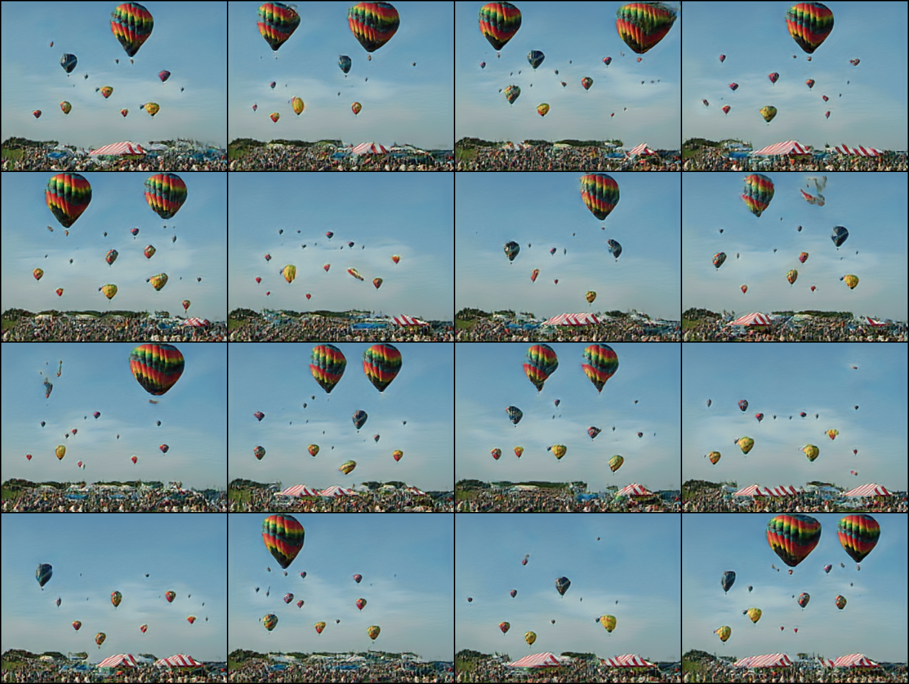

A simple unofficial Pytorch implementation of [SinGAN](https://arxiv.org/pdf/1905.01164.pdf)

This implementation can also run with multiple input images or copies of the same image
# Run
edit the image paths main.py and run 
```
python3 main.py 
```

Here are 16 samples from a model trained on "Images/balloons.png"




# Credits
- https://github.com/tamarott/SinGAN
- https://github.com/kligvasser/SinGAN
- https://github.com/tohinz/ConSinGAN

# Cite
```
@inproceedings{rottshaham2019singan,
  title={SinGAN: Learning a Generative Model from a Single Natural Image},
  author={Rott Shaham, Tamar and Dekel, Tali and Michaeli, Tomer},
  booktitle={Computer Vision (ICCV), IEEE International Conference on},
  year={2019}
}
```